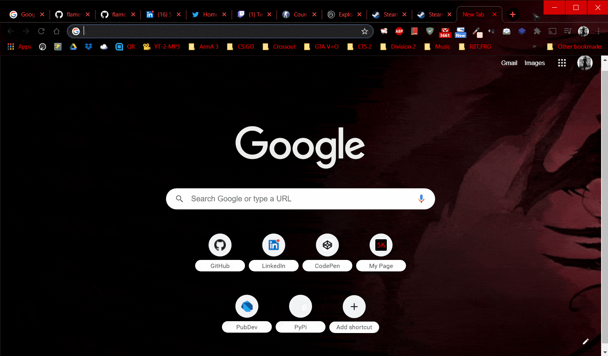
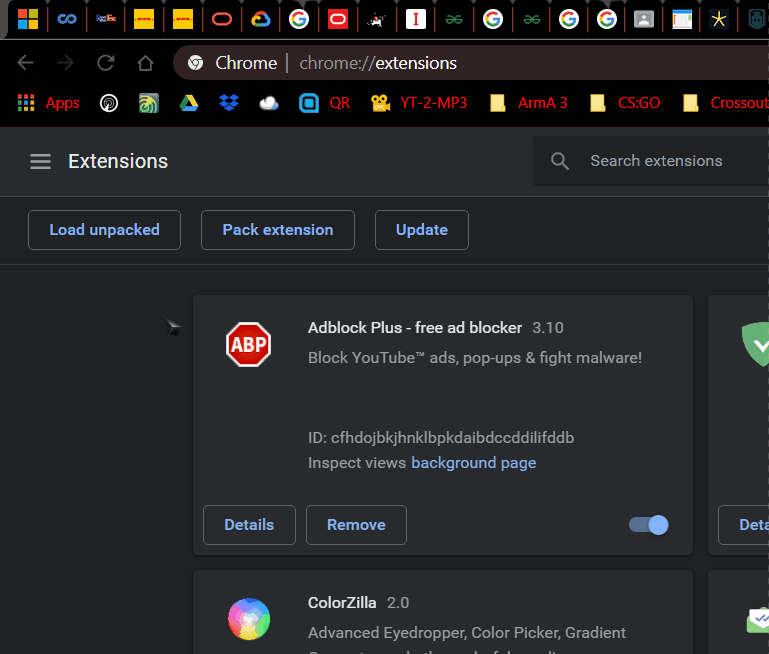
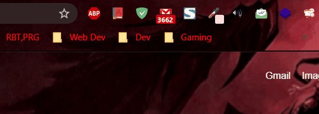

<h1 align="center">
  <br>
  <a href="https://github.com/flametron/FindIT-Chrome-Extension"></a>
  <br>
  FindIT!
  <br>
</h1>

<h4 align="center">Find your lost chrome tab!</h4>

<p align="center">
  <a href = "https://github.com/flametron/FindIT-Chrome-Extension/releases/"></a>
  <a href = "https://github.com/flametron/FindIT-Chrome-Extension/commits/"></a>
  
  <a href = "#contribute"></a>
  <a href = "./LICENSE.md"></a>
</p>

<p align="center">
  <a href="#key-features">Key Features</a> •
  <a href="#license">License</a>
</p>



## Key Features

* Has both Dark and Light theme (changes according to your system preferred theme)
* Easy to use
* Finds your tab easily
* Shows special symbol if tab is playing audio
* Cross platform
  - Windows, macOS, chromeOS and Linux ready.
  - Shortcuts ready for Windows and Linux.

## Installation

- To use the extension you need to download the `FindIT.crx` installer from our [Releases](https://github.com/flametron/FindIT-Chrome-Extension/releases/).  
- Then go to [chrome://extensions/](chrome://extensions/) and     turn on Developer Mode  
  
- Clone this repo to your local machine
  ```bash
  git clone https://github.com/flametron/FindIT-Chrome-Extension.git
  ```
- Click on "Load unpacked" on the Extensions screen and select the cloned directory `FindIT-Chrome-Extension`.  
  
- Done! You have the extension installed!

Additional Steps:  
- You can bring out the extension outside of the menu by pinning it.  
  

## How To Use

There are two ways to open the extension:
- By clicking on the extension icon.  
  
- By using the shortcut keys:  
  Windows and Linux: `Ctrl+Shift+F`

After the extension has opened, you can start typing the tab's name and it will start finding it for you.  
If multiple tabs have the same title, it will also display the URL.

After you have found the tab you want to go to, just click on it, and you will be taken there!

## Download

You can download the latest `.crx` file under our [Releases](https://github.com/flametron/FindIT-Chrome-Extension/releases/).

## Credits

- Icon Credits: [freepik.com](https://www.freepik.com/) and [Freepik Storyset](https://storyset.com/web)

## Contribute

Feel free to check [Issues](https://github.com/flametron/FindIT-Chrome-Extension/issues) to contribute to the project.

## When is it coming to the web store?

As soon as I pay the fee and publish it ;) 

## License

[GNU General Public License, version 3 (GPLv3)](./LICENSE.md)

---


<p align="center">
<a href="https://sayankundu.in/"></a>
<a href="https://github.com/flametron"></a>
<a href="https://www.linkedin.com/in/sayan-kundu-flametron/"></a>
<a href="./issues/"></a>
</p>
